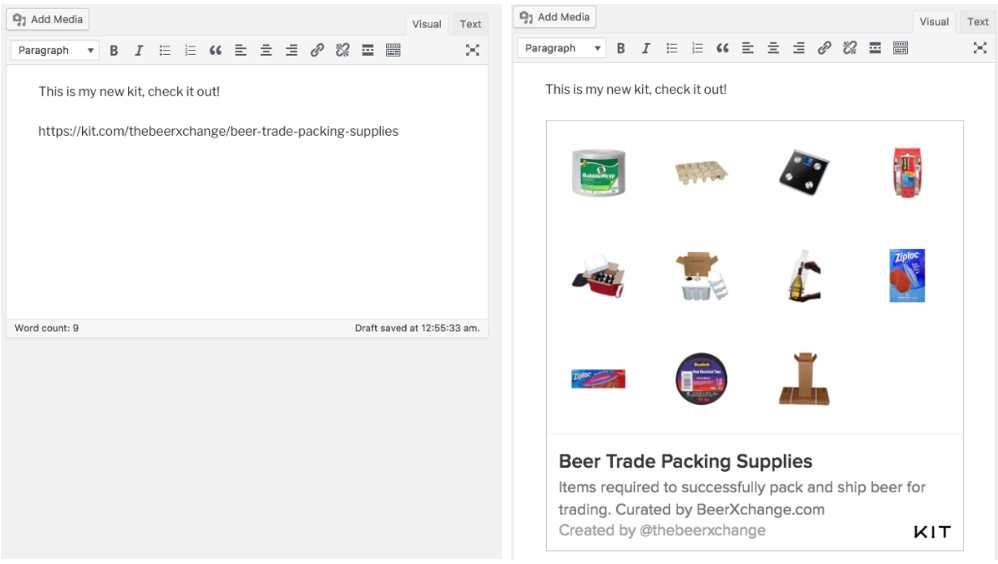

# Kit WordPress Plugin

    Contributors: kit
    Tags: kit, oembed, embed
    Requires at least: 2.9.1
    Tested up to: 4.3.1
    Stable tag: 0.8

Share beautiful, interactive kits of product recommendations on your blog.

## Description

On [Kit.com](https://kit.com), people create and share unique collections of
their favorite products.

If you have a WordPress blog, you can copy a link to your kit, paste the URL
into the post editor, press “Enter” and it will replace the link with an
interactive, shoppable kit of your recommendations. Here is how you can set it
up:

For example:

    Check out this kit of my favorite stuff:

    https://kit.com/thebeerxchange/beer-trade-packing-supplies

    That is what I recommend you use.

WordPress will automatically turn the URL into an interactive module that users can click on to preview products recommended in the kit.

This plugin uses WordPress [Embed](https://codex.wordpress.org/Embeds) functionality which was introduced in WordPress 2.9.

## Installation

1. In Your WordPress Admin Dashboard, go to Plugins > Add New.
2. Search for "Kit WordPress Plugin".
3. Find the plugin and click "Install".

## Manual Installation

If you are self-hosting WordPress you can also build this plugin locally.

1. Clone this git repository.
2. `cd src && zip kit.zip *`
3. In Your WordPress Admin Dashboard, go to Plugins > Add New.
4. Click "Choose File" and select the zip file you just generated.
5. Click "Install Now".
6. Click "Activate Plugin".

## Feedback

Learn more about our Kit embed module
[on our blog](https://blog.kit.com/improved-kit-embeds-d5e1262b7f67).

## Changelog

### 0.1

* Initial release
